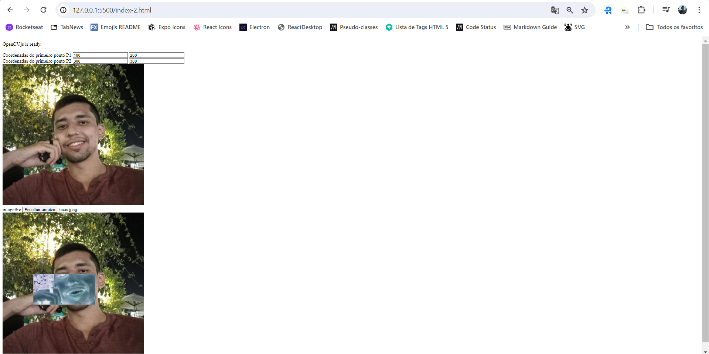
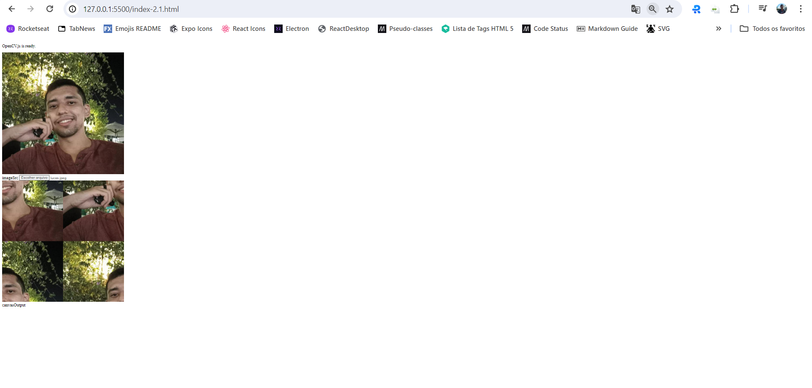
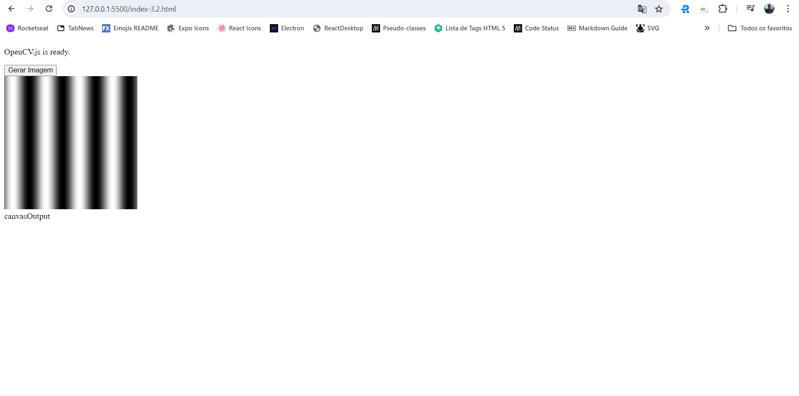
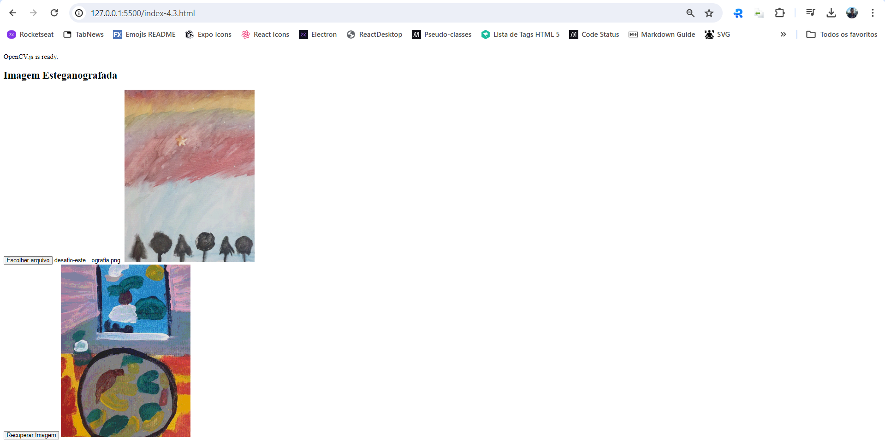
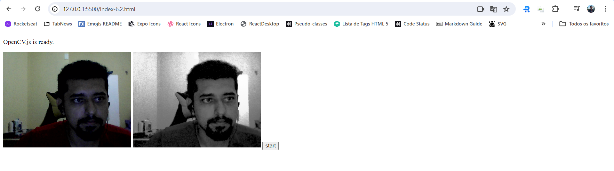
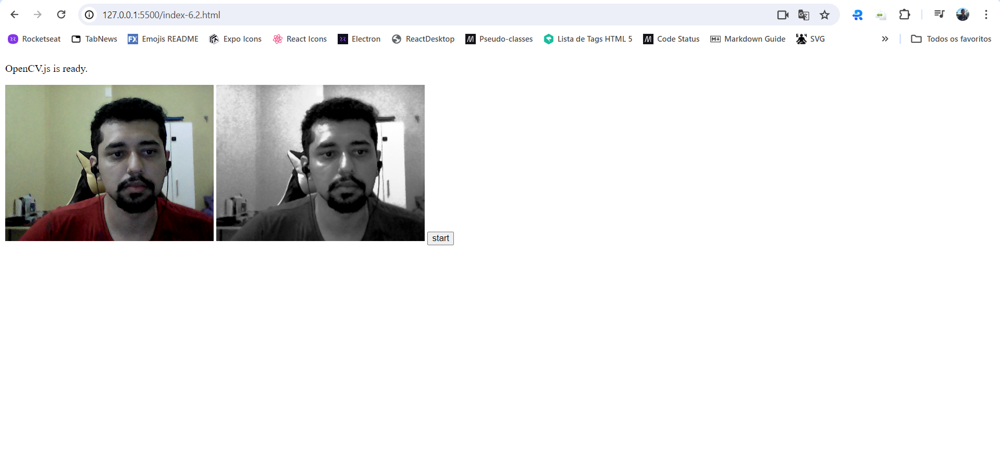

# PROCESSAMENTO DIGITAL DE IMAGENS (PDI)

*Observação: Como utilizo o pc da empresa utilizei JavaScript e o OpenCV.js, dessa forma algumas atividades não foram possiveis utilizar devido a limitação o OpenCVjs*

**2.2. Exercícios**

* Utilizando o programa da Listagem 4 como referência, implemente um programa regions.cpp. Esse programa deverá solicitar ao usuário as coordenadas de dois pontos P1 e P2 localizados dentro dos limites do tamanho da imagem e exibir que lhe for fornecida. Entretanto, a região definida pelo retângulo de vértices opostos definidos pelos pontos P1 e P2 será exibida com o negativo da imagem na região correspondente. O efeito é ilustrado na Figura 4.

**Resposta 1:**

Se abrir o arquivo index-2.html vai renderizar uma página com quatro inputs númericos que correspondem as coordenadas dos dois pontos. Em seguida utilizando o input imageSrc é possível adicionar a imagem na qual você quer aplicar o negativo.

* Utilizando o programa da Listagem 4 como referência, implemente um programa trocaregioes.cpp. Seu programa deverá trocar os quadrantes em diagonal na imagem. Explore o uso da classe cv::Mat e seus construtores para criar as regiões que serão trocadas. O efeito é ilustrado na Figura 5. Assuma que a imagem de entrada tem dimensões múltiplas de 2 para facilitar a implementação do processo de troca.

**Resposta 2:**

Se abrir o arquivo index-2.1.html vai renderizar uma página com um input que recebe a imagem e em seguida ele aplica a divisão da imagem e gera a nova imagem.

**3.2. Exercícios**

* Utilizando o programa-exemplo filestorage.cpp como base, crie um programa que gere uma imagem de dimensões 256x256 pixels contendo uma senóide de 4 períodos com amplitude igual 127 desenhada na horizontal, semelhante àquela apresentada na Figura 6. Grave a imagem no formato YML e também exporte no formato PNG, como faz o programa-exemplo. Compare os arquivos gerados, extraindo uma linha correspondente de cada imagem gravada e comparando a diferença entre elas. Trace um gráfico da diferença calculada ao longo da linha correspondente extraída nas imagens. O que você observa? Por que isso acontece?

**Resposta:**

PNG é um formato comprimido com um algoritmo de compressão sem perda, mas ainda assim pode introduzir pequenas variações devido a técnicas de compressão. Essas pequenas alterações podem surgir ao compactar dados para reduzir o tamanho do arquivo.
YML, no entanto, é um formato de armazenamento de dados usado pelo OpenCV, que geralmente preserva informações com alta fidelidade, sem compressão significativa. Isso pode resultar em uma representação mais precisa dos dados da imagem.

**4.3. Exercícios**

* Usando o programa bitplanes.cpp como referência para esteganografia, escreva um programa que recupere a imagem codificada de uma imagem resultante de esteganografia. Lembre-se que os bits menos significativos dos pixels da imagem fornecida deverão compor os bits mais significativos dos pixels da imagem recuperada. O programa deve receber como parâmetros de linha de comando o nome da imagem resultante da esteganografia. Teste a sua implementação com a imagem da Figura 13 (desafio-esteganografia.png).

**Resposta:**

Se abrir o arquivo index-3.2.html vai renderizar uma página com um input que recebe a imagem para fazer a "decodificação" da imagem inserida.

**6.2. Exercícios**

* Utilizando o programa exemplos/histogram.cpp como referência, implemente um programa equalize.cpp. Este deverá, para cada imagem capturada, realizar a equalização do histogram antes de exibir a imagem. Teste sua implementação apontando a câmera para ambientes com iluminações variadas e observando o efeito gerado. Assuma que as imagens processadas serão em tons de cinza.

**Resposta:**

